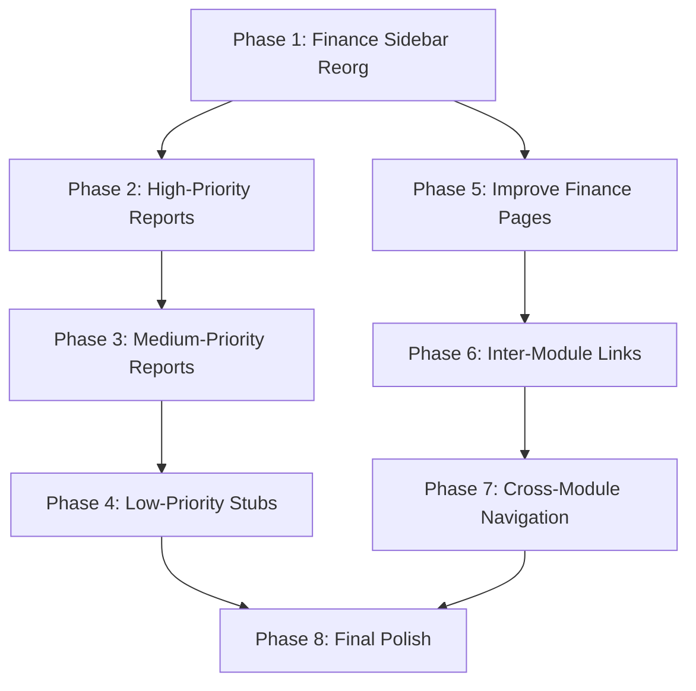

# P7 ERP Full System Improvement Plan

This plan covers 8 phases across ~50 tasks: Finance sidebar reorganization, building all stub pages, improving existing pages, strengthening inter-module links, and adding cross-module navigation.

---

## Phase 1: Finance Sidebar Reorganization

**Problem:** Finance has 31 flat items — the most of any sidebar section and difficult to navigate. HR already uses the `subsections` pattern successfully.

**What to change in** `[frontend/src/app/sidebarConfig.tsx](frontend/src/app/sidebarConfig.tsx)` (lines 305-340):

Convert the Finance `items[]` array to `subsections[]` (same pattern HR uses at line 221):

```
Finance
  Setup           -> Advance Options, Account Groups, Chart of Accounts,
                     Cost Centers, Multi-Currency, Accounting Periods*
  Transactions    -> Vouchers, Voucher Print, Voucher Approvals,
                     Bills, Purchase & AP
  Banking         -> Bank Accounts, Bank Reconciliation, Payment Runs,
                     Payment Advice, Settlement Audit, FX Receipts
  Reports         -> Day Book, Trial Balance, Financial Statements,
                     Cash Flow, AR/AP Aging, Ledger Activity,
                     Voucher Analytics, Group Summary, Ratio Analysis
  Planning        -> Budgets, Cash Forecast, Cashflow Calendar,
                     Style Profitability, LC Profitability, Costing Variance
```

*Move Accounting Periods from Settings section into Finance > Setup (it belongs with finance configuration).

**Files:** `[sidebarConfig.tsx](frontend/src/app/sidebarConfig.tsx)` only. No route changes needed — just reorganizing navigation grouping.

---

## Phase 2: Build High-Priority Missing Report Pages (frontend-only, backend data exists)

All stubs currently use `[ReportComingSoonPage](frontend/src/pages/app/reports/ReportComingSoonPage.tsx)`. Replace each with a real page that calls existing backend endpoints.

### 2A. LC Outstanding Report (`/reports/lc-outstanding`)

- **New file:** `frontend/src/pages/app/reports/ReportLcOutstandingPage.tsx`
- **Backend:** `GET /api/v1/commercial/master-contracts` (has `amount`, `btb_utilized_amount`, `btb_utilization_pct`, `expiry_date`)
- **UI:** Filter by status; table with contract ref, buyer, amount, utilized, remaining, expiry; total summary cards
- **Links to:** Master contract detail, BTB LCs page

### 2B. BTB LC Maturity Report (`/reports/btb-maturity`)

- **New file:** `frontend/src/pages/app/reports/ReportBtbMaturityPage.tsx`
- **Backend:** `GET /api/v1/commercial/btb-lcs` (has `maturity_date`, `maturity_amount`, `status`, `accounting_status`)
- **UI:** Filter by maturity date range, status; table with LC ref, vendor, amount, maturity date, days to maturity, status; aging buckets (0-30, 31-60, 61-90, 90+)
- **Links to:** BTB LC detail, vendor page

### 2C. Shipment Tracking Report (`/reports/shipments`)

- **New file:** `frontend/src/pages/app/reports/ReportShipmentsPage.tsx`
- **Backend:** `GET /api/v1/logistics/shipments` (has reference, status, carrier, ETD/ETA, ports, BL/AWB)
- **UI:** Filter by status, date range; table with ref, carrier, origin/dest ports, ETD, ETA, BL/AWB, status; status badges
- **Links to:** Trade case detail

### 2D. Cashflow Calendar (`/cashflow/calendar`)

- **Modify:** Currently `AppComingSoonPage` in `[AppProtectedRouter.tsx](frontend/src/app/AppProtectedRouter.tsx)` line 513
- **New file:** `frontend/src/pages/app/CashflowCalendarPage.tsx`
- **Backend:** `GET /api/v1/finance/cash-forecast/summary` + `GET /api/v1/finance/bills` (receivable/payable) + `GET /api/v1/commercial/btb-lcs` (maturity dates)
- **UI:** Monthly grid/calendar showing expected inflows (receivables due) and outflows (payables due, LC maturities) by date; net position per day/week
- **Links to:** Cash forecast, outstanding bills, BTB LCs

---

## Phase 3: Build Medium-Priority Report Pages

### 3A. Production Efficiency Report (`/reports/production-efficiency`)

- **New file:** `frontend/src/pages/app/reports/ReportProductionEfficiencyPage.tsx`
- **Backend:** `GET /api/v1/manufacturing/execution/dashboard` (has OEE, work order counts, operations, downtime) + `GET /api/v1/manufacturing/execution/dashboard/downtime-reasons` + `GET /api/v1/manufacturing/execution/dashboard/downtime-trend`
- **UI:** Summary KPIs (OEE, completion rate, downtime); downtime by reason chart; daily trend; date range filter

### 3B. QC Summary Report (`/reports/qc-summary`)

- **New file:** `frontend/src/pages/app/reports/ReportQcSummaryPage.tsx`
- **Backend:** `GET /api/v1/manufacturing/quality/dashboard` (has inspections pass/fail/rate, defect distribution, NCR/CAPA counts)
- **UI:** Pass rate card; defect distribution breakdown; NCR count by severity; CAPA status; date range filter

### 3C. Employee Summary Report (`/reports/employee`)

- **New file:** `frontend/src/pages/app/reports/ReportEmployeeSummaryPage.tsx`
- **Backend:** `GET /api/v1/hr/reports/summary` + `GET /api/v1/hr/reports/attendance`
- **UI:** Headcount, attendance rate, department-wise breakdown; month filter

### 3D. Payroll Summary Report (`/reports/payroll`)

- **New file:** `frontend/src/pages/app/reports/ReportPayrollSummaryPage.tsx`
- **Backend:** `GET /api/v1/hr/reports/payroll` (has per-run totals: gross, deductions, net)
- **UI:** Year filter; table of payroll runs with totals; summary cards (YTD gross, deductions, net)

### 3E. Data Reconciliation Report (`/reports/reconciliation`)

- **New file:** `frontend/src/pages/app/reports/ReportReconciliationPage.tsx`
- **Backend:** Multiple endpoints (finance trial balance + inventory valuation + bank recon)
- **UI:** Cross-check panels: GL vs subledger, stock value vs GL, bank statement vs GL; highlight mismatches
- **Note:** May need a new backend aggregation endpoint for cross-module data

### 3F. Exceptions Report (`/reports/exceptions`)

- **New file:** `frontend/src/pages/app/reports/ReportExceptionsPage.tsx`
- **Backend:** Combine alerts from merch (`GET /api/v1/merch/alerts`) + trade alerts + budget vs actual variances
- **UI:** Unified exception list with severity, module source, entity link, date

---

## Phase 4: Build Low-Priority Stub Pages

### 4A. Gate Pass Register Report (`/reports/gate-passes`)

- **Backend:** `GET /api/v1/inventory/enhanced-gate-passes` (has code, purpose, destination, vehicle, status)
- **UI:** Date range filter, status filter; table with gate pass details; export CSV

### 4B. Delivery Challans Report (`/reports/challans`)

- **Backend:** `GET /api/v1/inventory/delivery-challans` (has code, customer, date, status, items)
- **UI:** Date/status filters; table; summary of posted vs draft

### 4C. Lot Traceability (`/inventory/lots`)

- **Backend:** Currently no dedicated lot endpoints — `goods_receiving_items` has `lot_number` field; `stock_movements` track by item
- **Approach:** New backend endpoint `GET /api/v1/inventory/lot-trace?lot_number=X` that queries `goods_receiving_items` by lot + traces downstream `stock_movements`
- **Migration:** None needed (lot_number column exists)
- **UI:** Lot number search; trace tree showing GRN -> movements -> current location

### 4D. Reports Hub (`/reports`)

- Replace `AppComingSoonPage` with a tile dashboard linking to all report pages
- Group tiles by module: Merchandising, Finance, Inventory, HR, Manufacturing, Commercial

---

## Phase 5: Improve Existing Finance Pages

### 5A. AdvanceOptionsPage — expand from 1 card to full hub

- **File:** `[AdvanceOptionsPage.tsx](frontend/src/pages/app/AdvanceOptionsPage.tsx)` (~52 lines)
- Add cards for: CoA Config (`GET/PUT /finance/coa-config`), CoA Import/Export (`/finance/coa/import`, `/finance/coa/export`), Voucher Types management, Bill Reference settings, Accounting Period defaults
- Each card links to the relevant page or opens an inline form

### 5B. RatioAnalysisPage — expand ratio suite

- **File:** `[RatioAnalysisPage.tsx](frontend/src/pages/app/RatioAnalysisPage.tsx)` (~127 lines)
- Add: Current Ratio, Quick Ratio, Inventory Turnover, Receivables Turnover, Payables Turnover
- Add period comparison (select two dates, show delta)
- Data source: same `financial-statements` endpoint + `bills/aging` for turnover ratios

### 5C. OutstandingBillsPage — integrate bill references

- **File:** `[OutstandingBillsPage.tsx](frontend/src/pages/app/OutstandingBillsPage.tsx)` (~184 lines)
- Add: auto-create from voucher button (`POST /finance/bill-references/auto-create/{voucher_id}`), allocation view, link to voucher detail
- Add: link to AR/AP Aging report page

### 5D. ProfitabilityPage — add trade case mode

- **File:** `[ProfitabilityPage.tsx](frontend/src/pages/app/ProfitabilityPage.tsx)` (~147 lines)
- Add 4th tab: "Trade Case Profitability" using trade case margin data (`GET /api/v1/trade-cases` has margin fields)
- Replace raw `Object.entries` display with structured KPI cards + breakdown table
- Add links to style detail / order detail pages

### 5E. BudgetsPage — add edit/delete + fiscal year filter

- **File:** `[BudgetsPage.tsx](frontend/src/pages/app/BudgetsPage.tsx)` (~259 lines)
- Add fiscal year filter (backend supports `fiscal_year` param)
- Add edit and delete budget actions
- Add visual chart for budget vs actual comparison

### 5F. CostCentersPage — add is_active toggle + Actions dropdown

- **File:** `[CostCentersPage.tsx](frontend/src/pages/app/CostCentersPage.tsx)` (~132 lines)
- Add `is_active` checkbox in form
- Switch row buttons to combined Actions dropdown (per project rules)
- Add link to cost center dashboard for each center

### 5G. AccountsCurrencyPage — add edit/delete rate

- **File:** `[AccountsCurrencyPage.tsx](frontend/src/pages/app/AccountsCurrencyPage.tsx)` (~144 lines)
- Add edit and delete for exchange rates
- Add link to FX Receipts page

### 5H. CashForecastPage — add edit/delete scenario

- **File:** `[CashForecastPage.tsx](frontend/src/pages/app/CashForecastPage.tsx)` (~164 lines)
- Add edit and delete scenario
- Link to Cashflow Calendar (once built)

### 5I. AccountingPeriodsPage — use Actions dropdown pattern

- **File:** `[AccountingPeriodsPage.tsx](frontend/src/pages/app/AccountingPeriodsPage.tsx)` (~143 lines)
- Replace separate Close/Reopen/Delete buttons with combined Actions dropdown
- Add visual timeline of periods (open, closed, future)

---

## Phase 6: Strengthen Inter-Module Connections

### 6A. Employee-User Link (backend migration + model)

- **New migration 091:** Add `user_id` (FK, nullable, unique) to `hr_employees` table
- **Update model:** `[backend/app/models/hr.py](backend/app/models/hr.py)` — add `user_id` column
- **Update HR router:** Auto-resolve employee from logged-in user in ESS endpoints
- **Update HR Employee form (frontend):** Add optional user dropdown when creating/editing employee

### 6B. Vendor Payment History on Vendor Detail

- **Frontend:** Add "Payment History" tab on vendor detail drawer (`[VendorDetailDrawer.tsx](frontend/src/pages/app/components/vendors/VendorDetailDrawer.tsx)`)
- Query vouchers where `account_id` matches vendor's `ledger_id` (Sundry Creditors link)
- Show payment runs that include this vendor

### 6C. Customer/Vendor → Aging Cross-Link

- On Customer detail page: show "Outstanding Bills" section using `GET /finance/bills?party_type=receivable&account_id={ledger_id}`
- On Vendor detail: similar with `party_type=payable`
- Add "View Full Aging" link to AR/AP Aging report

### 6D. BTB LC Maturity → Cash Forecast Integration

- When generating cash forecast scenarios, include BTB LC maturity dates as expected outflows
- **Backend change:** In `/finance/cash-forecast/scenarios/{id}/generate`, query `btb_lcs` with upcoming `maturity_date` and include as outflow lines
- **Frontend:** Show LC-sourced lines distinctly in the scenario detail

### 6E. Manufacturing Completion → Delivery Challan Flow

- On production overview / work order completion: add "Create Delivery Challan" button
- Pre-fill challan with finished goods item + quantity from completed work order
- **Frontend only** — link work order completion to `/inventory/delivery-challans` with query params

### 6F. GRN → Auto-suggest AP Voucher

- On GRN detail or after GRN approval: show banner "Create Payable Voucher from this GRN"
- Uses existing `POST /finance/purchase-workflow/create-payable-from-grn/{grn_id}`
- **Frontend:** Add action button on GRN row in Goods Receiving page

---

## Phase 7: Cross-Module Navigation & UX

### 7A. "Related Records" Sections on Detail Pages

Add a "Related" panel (or tabs) on key detail pages showing linked records:

- **Order Detail:** Show linked quotation, proforma invoices, trade case, shipments, consumption plan, production plan
- **Trade Case Detail:** Already has some; ensure links to vouchers, shipments, documents, proforma, master contract, BTB LC
- **Customer Detail:** Orders, inquiries, quotations, outstanding bills, intermediaries
- **Vendor Detail:** POs, GRNs, outstanding bills (payable), payment history
- **BTB LC Detail:** Master contract, PO, accounting lifecycle (vouchers), maturity report link
- **Style Detail:** BOMs, orders, consumption plans, production plans, profitability link

### 7B. "Create Next" Action Buttons

Add workflow progression buttons on key pages:

- **Inquiry detail** → "Create Quotation" (already exists, verify)
- **Quotation detail** → "Create Order" (already exists, verify)
- **Order detail** → "Create Proforma Invoice", "Create Trade Case"
- **Proforma detail** → "Create Master Contract", "Create BTB LC"
- **GRN row** → "Create AP Voucher"
- **Work Order completion** → "Create Delivery Challan"
- **BTB LC** → "Record LC Open Voucher", "Record Import Bill", "Record Realization"

### 7C. Breadcrumb Trail for Document Flow

- Show contextual breadcrumb on detail pages: `Order ORD-001 > Proforma PI-001 > Master Contract MC-001 > BTB LC BTB-001`
- Derive from FK chain; render as clickable links

---

## Phase 8: Final Polish

### 8A. Actions Dropdown Audit

Audit all table pages and convert separate Edit/Delete icon buttons to combined "Actions" dropdown per project rules. Key pages to fix:

- `CostCentersPage`, `AccountingPeriodsPage`, `BudgetsPage`, `CashForecastPage`

### 8B. Error Handling Audit

- Replace empty `.catch()` handlers with `logApiError` (per audit finding)
- Add loading skeletons on all report pages

### 8C. Reports Hub Dashboard

Replace the `/reports` coming-soon stub with a proper dashboard showing tiles grouped by module, each linking to its report page with a mini-stat preview

---

## Implementation Order




**Estimated effort:** Phase 1 (0.5 day) → Phase 2 (2-3 days) → Phase 3 (2-3 days) → Phase 5 (2-3 days) → Phase 4 (1-2 days) → Phase 6 (3-4 days) → Phase 7 (2-3 days) → Phase 8 (1-2 days). Total: ~14-21 working days.

Phases 1, 2, and 5 can partially run in parallel since they touch different files.